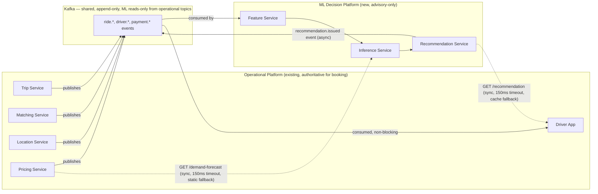

# Intelligent Demand-Supply Optimization Platform
## An ML Decision Layer for the Glovatrix Ride-Hailing System — Engineering Design Document

**Author:** ML Platform / Distributed Systems Architecture
**Status:** Proposal for Review
**Audience:** Staff/Principal Engineering Review

---

## Table of Contents

1. Executive Summary
2. Functional Requirements
3. Non-Functional Requirements
4. Complete High-Level Architecture
5. Component Deep Dive
6. Event-Driven Architecture
7. Data Architecture
8. Geospatial System Design
9. Machine Learning System Design (FR-01 through FR-10)
10. Feature Engineering
11. Complete MLDLC
12. MLOps Platform
13. Model Serving Architecture
14. Low-Level Design
15. Scaling
16. Failure Scenarios
17. Trade-offs
18. Security
19. Observability
20. Final Architecture Summary

---

## 1. Executive Summary

### 1.1 Business Problem

The existing ride-hailing platform is a **reactive** system: a rider requests a ride, and the matching service finds whatever driver happens to be nearby at that instant. This works, but it leaves value on the table in three specific ways:

1. **Supply is misallocated in space.** Drivers idle in low-demand zones while high-demand zones go under-served, because no one is telling drivers where demand is *about* to appear — only where a rider happens to be *right now*.
2. **Surge pricing is reactive, not predictive.** By the time the demand/supply ratio in a geohash cell crosses the surge threshold, riders are already experiencing long ETAs. A predictive system could pre-position supply *before* the imbalance happens, reducing the need for surge at all.
3. **No feedback loop.** The operational platform captures ride outcomes (accepted, rejected, cancelled, completed) but nothing today uses that history to make the *next* decision measurably better. Every dispatch is stateless with respect to long-run optimization.

### 1.2 Engineering Problem

We need a system that can:
- Forecast demand at fine spatial and temporal granularity (per zone, per 15-minute window) *before* it materializes.
- Continuously monitor supply (online drivers, idle drivers, drivers about to end trips) at the same granularity.
- Recommend driver repositioning that improves expected match rate and reduces expected rider wait time, without commanding drivers (drivers are not employees in most markets — this is a *recommendation*, not a *dispatch order*).
- Learn from the outcomes of its own recommendations (did the driver follow it? did it help?) and improve over time.
- Do all of this as a **bolt-on system**: read from the operational platform via events and APIs, write recommendations back the same way, and never become a dependency the booking system cannot survive without.

### 1.3 Why ML Is Needed

Demand is a noisy, seasonal, spatially-correlated, weather-and-event-sensitive time series measured over tens of thousands of geographic cells across thousands of cities. Hand-written heuristics ("if it's raining, tell drivers to go downtown") do not scale past a handful of cities and do not adapt when patterns shift (a new stadium opens, a metro line closes, a pandemic changes commute patterns). A learned system that ingests historical trip data, weather, events, and real-time supply signals can generalize across geographies and adapt automatically via retraining — which a rules engine fundamentally cannot do at this scale.

### 1.4 Expected Business Impact

| Metric | Mechanism | Expected Direction |
|---|---|---|
| Rider wait time (ETA to pickup) | Supply pre-positioned ahead of demand | ↓ |
| Driver idle time / utilization | Drivers guided toward zones with real demand | ↑ utilization, ↓ idle |
| Surge frequency & magnitude | Demand-supply imbalance prevented rather than priced around | ↓ surge events |
| Ride completion rate | Fewer "no driver found" cancellations | ↑ |
| Driver earnings per online hour | More rides per hour of availability | ↑ |
| Platform take-rate stability | Less reliance on surge as a lever means more predictable pricing, better long-run retention | Indirect ↑ retention |

This is explicitly framed as an **optimization layer**, not a new product surface. Riders and drivers interact with the same apps; the ML platform's only visible effect is that drivers occasionally see a "recommended zone" nudge, and riders occasionally see lower ETAs and less surge than they otherwise would have.

### 1.5 Design Philosophy — The Non-Negotiable Constraint

> **The operational ride-hailing platform must be able to book, match, track, and complete rides with zero dependency on the ML platform being alive.**

This single constraint shapes nearly every architectural decision in this document:
- The ML platform is a **consumer** of operational events, never a **blocking participant** in the booking critical path.
- All ML outputs (zone recommendations, demand forecasts, hotspot alerts) are delivered as **advisory signals** — read by the driver app, the pricing service, and an admin dashboard — that degrade gracefully to "no recommendation" if stale or absent.
- Communication is **event-driven and asynchronous** wherever possible; the few synchronous calls (e.g., driver app polling for a recommended zone) have aggressive timeouts and fallback-to-nothing behavior.

---

## 2. Functional Requirements

### 2.1 Existing Ride-Hailing Platform FRs (recap, ~30% weight)

| ID | Requirement | Detail |
|---|---|---|
| RH-FR-01 | Rider/Driver registration & auth | Phone-based OTP auth, KYC/document verification for drivers |
| RH-FR-02 | Driver online/offline toggle | Drivers explicitly mark availability; only ONLINE+AVAILABLE drivers are matchable |
| RH-FR-03 | Ride request & fare estimate | Rider provides pickup/drop, receives estimated fare and ETA before booking |
| RH-FR-04 | Nearest-driver matching | Redis-geo-backed radius search + ranking, sub-100ms |
| RH-FR-05 | Real-time driver tracking | Live location streamed to rider during active trip |
| RH-FR-06 | Ride lifecycle management | State machine from REQUESTED to RATED, with cancellation paths |
| RH-FR-07 | Fare calculation & surge pricing | Base fare + distance + time + reactive surge multiplier |
| RH-FR-08 | Payment processing | Charge on completion, idempotent, async retry on failure |
| RH-FR-09 | Ride history & receipts | Durable record per rider/driver, queryable |
| RH-FR-10 | Ratings & reviews | Bidirectional rating post-trip, feeds trust score |
| RH-FR-11 | Notifications | Push/SMS at each major state transition |

These are described in Section 4 (architecture) and Section 5 at the depth needed to show integration points; they are **not** re-derived from scratch since they are already production-proven.

### 2.2 ML Platform Functional Requirements (~70% weight)

#### FR-01 — Demand Prediction
The system shall forecast ride-request volume per zone per time window (e.g., H3 resolution-8 cell, 15-minute buckets), at a rolling horizon of 15 minutes to 2 hours ahead, refreshed continuously as new data arrives.

#### FR-02 — Supply Monitoring
The system shall maintain a real-time view of driver supply per zone: count online, count idle/available, count about to become available (trip ending soon), refreshed at sub-minute latency.

#### FR-03 — Zone Recommendation
The system shall recommend to idle drivers which nearby zone to reposition to, ranked by expected marginal benefit (predicted demand deficit weighted by expected earnings and driver's current distance to that zone).

#### FR-04 — Driver Redistribution (Fleet-Level Optimization)
Beyond single-driver recommendations, the system shall periodically compute a fleet-level repositioning plan that balances supply across zones in a given operating area, avoiding the failure mode where every driver is individually told to go to the same single hot zone.

#### FR-05 — Feedback Collection
The system shall capture whether a driver followed a recommendation, and the outcome (did they get a ride shortly after, how long did they wait), closing the loop for both offline evaluation and online learning.

#### FR-06 — Online Learning
The system shall support incremental model updates from streaming feedback (e.g., contextual bandit arm updates) without requiring a full batch retrain, so recommendation quality adapts within hours, not days, to genuinely new patterns (e.g., a sudden road closure).

#### FR-07 — External Feature Integration
The system shall ingest and join external signals — weather, calendar/holidays, city events (concerts, sports, flights) — into the feature pipeline so predictions account for known demand drivers beyond historical trip patterns.

#### FR-08 — Hotspot Detection
The system shall detect anomalous, rapidly-forming demand spikes (e.g., a flash mob, a subway outage) that deviate from the forecast, and surface them to drivers and ops faster than the standard forecast refresh cycle would.

#### FR-09 — Return Trip Recommendation
The system shall recommend to a driver, upon completing a drop-off in a low-demand area, the nearest zone with meaningfully better expected demand, factoring in the driver's likely direction of travel/shift end.

#### FR-10 — Admin Analytics
The system shall provide an internal dashboard for ops/city teams to view demand forecasts, supply heatmaps, recommendation adoption rates, and model health, at the city and zone level.

---

## 3. Non-Functional Requirements

| Category | Requirement | Notes |
|---|---|---|
| **Scalability** | Support 100M riders, 10M+ registered drivers, millions concurrently online, thousands of GPS updates/sec, thousands of predictions/sec at peak | Same physical scale as the operational platform, since this is a bolt-on |
| **Availability** | ML platform target 99.9% (one order of magnitude looser than the 99.99% booking path) | Deliberately lower — see 1.5. Booking must survive ML platform being fully down |
| **Latency** | Zone recommendation: < 200ms p99 (app-facing); demand forecast refresh: < 2 min; hotspot detection: < 30s from signal to alert | Recommendation is advisory, so slightly looser than the 100ms hard matching SLA |
| **Reliability** | No single ML component failure should degrade booking; recommendation staleness must be visible/expire, never silently wrong | TTL on every cached prediction |
| **Consistency** | Eventual consistency throughout the ML platform; no ML data path requires strong consistency | Matches the "advisory, not authoritative" design |
| **Fault Tolerance** | Every ML service has a defined degraded mode (return "no recommendation" / last-known-good) rather than an error | Explicit fallback contracts, Section 16 |
| **Observability** | Full metrics/logs/traces for every ML component, plus ML-specific: prediction drift, feature drift, model staleness, recommendation adoption rate | Section 19 |
| **Security** | Feature store and training data must not leak PII into models or logs; driver location data retention limits | Section 18 |
| **Maintainability** | Every model versioned, every training run reproducible, every deployment via CI/CD with no manual artifact handling | Section 12 |
| **Cost Optimization** | Batch (Spark) for heavy offline compute, streaming only where sub-minute freshness genuinely matters, CPU inference by default with GPU reserved for models that need it | Section 13, 17 |
| **ML Reliability** | Models must have automated rollback on metric regression, and a documented "kill switch" that reverts the platform to zero ML influence instantly | Section 11, 16 |
| **Model Explainability** | Zone recommendations must be explainable in simple terms shown to drivers ("demand expected to rise in this zone") and in feature-attribution terms for ops | SHAP-based attribution for the demand model |
| **Model Fairness** | Recommendations must not systematically disadvantage drivers in any protected-characteristic-correlated area; fairness metrics tracked per zone/demographic proxy | Monitored, not just modeled |
| **Data Freshness** | Online features (supply counts, recent demand) must be < 1 min stale; offline/aggregate features can be hours stale | Tiered freshness, Section 10 |
| **Prediction SLA** | Every inference call has a hard timeout (150ms) with a static fallback if breached | Section 13 |

---

## 4. Complete High-Level Architecture

### 4.1 Combined System — ASCII Overview

```
                                   RIDER APP                 DRIVER APP
                                       │                          │
                                       └───────────┬──────────────┘
                                                    ▼
                                      ┌──────────────────────────┐
                                      │   API Gateway / LB        │
                                      └─────────────┬─────────────┘
                                                    │
                  ┌─────────────────────────────────┼─────────────────────────────────┐
                  ▼                                 ▼                                 ▼
     ┌─────────────────────────────┐   ┌─────────────────────────────┐   ┌─────────────────────────────┐
     │   OPERATIONAL PLATFORM       │   │   ML DECISION PLATFORM       │   │  ADMIN / OPS DASHBOARD      │
     │  (existing, production)      │   │  (new, this document)        │   │  (reads both)               │
     │                               │   │                               │   │                              │
     │  User Svc  Trip Svc           │   │  Feature Service              │   │  Demand heatmaps            │
     │  Matching  Pricing            │   │  Inference Service            │   │  Supply heatmaps            │
     │  Location  Payment            │   │  Recommendation Service       │   │  Recommendation adoption    │
     │  Notification                 │   │  Training Pipelines           │   │  Model health                │
     └───────────────┬───────────────┘   │  Model Registry               │   └─────────────────────────────┘
                     │                    │  Monitoring/Drift             │
                     │  events            └───────────────┬───────────────┘
                     ▼                                    │
        ┌─────────────────────────────────────────────────────────────────┐
        │                    Kafka  (shared event backbone)                │
        │  ride.requested  ride.completed  driver.location  driver.status  │
        │  payment.completed  ml.recommendation.issued  ml.feedback        │
        └───────────────┬─────────────────────────────┬─────────────────────┘
                        ▼                             ▼
             ┌────────────────────┐        ┌───────────────────────────┐
             │  OLTP (existing)    │        │   ML DATA PLANE            │
             │  PostgreSQL         │        │  Bronze/Silver/Gold Lake   │
             │  Cassandra          │        │  Offline Feature Store     │
             │  Redis (geo/state)  │        │  Online Feature Store      │
             └────────────────────┘        │  (Redis, separate cluster) │
                                            └───────────────────────────┘
```

### 4.2 Integration Contract Between the Two Systems

This is the most important diagram in the document because it is the boundary the entire "don't break booking" requirement depends on.



**Two integration modes, deliberately:**
1. **Async/event mode (primary)** — the ML platform only ever *reads* operational Kafka topics and *writes* its own `ml.*` topics. The operational platform never blocks on the ML platform in this mode.
2. **Sync/pull mode (secondary, opt-in)** — two call sites exist where the operational platform *may* call into the ML platform synchronously: the driver app polling for a recommended zone, and the pricing service optionally asking for a demand forecast to pre-emptively smooth surge. Both calls have a **150ms timeout and a defined fallback** (cached last-known value or a static default), so a dead ML platform degrades these features to "absent," never to an error or a stalled request.

### 4.3 Component Inventory (nothing omitted)

| Layer | Components |
|---|---|
| Client | Rider App, Driver App |
| Edge | API Gateway / Load Balancer |
| Operational services | User, Trip, Matching, Pricing, Location, Payment, Notification, Ratings |
| Operational storage | PostgreSQL (OLTP), Cassandra (history), Redis (geo + hot state) |
| Event backbone | Kafka (shared) |
| ML ingestion | Feature Service (streaming + batch consumers) |
| ML storage | Data Lake (Bronze/Silver/Gold on S3), Offline Feature Store, Online Feature Store (Redis), Feature Metadata Store |
| ML compute — offline | Spark (batch feature engineering), Airflow (orchestration), Training Pipeline (Kubeflow/SageMaker) |
| ML compute — online | Inference Service, Recommendation Service, Online Feature Lookup |
| ML lifecycle | Model Registry (MLflow), CI/CD, Canary/Shadow/A-B infra |
| ML monitoring | Drift detectors, Bias monitors, Prometheus/Grafana, OpenTelemetry tracing |
| Admin | Ops Dashboard (demand/supply heatmaps, model health, adoption metrics) |
| External | Maps/Routing API, Weather API, Events/Calendar API, Payment Gateway |

Every one of these is expanded in Section 5 onward.
